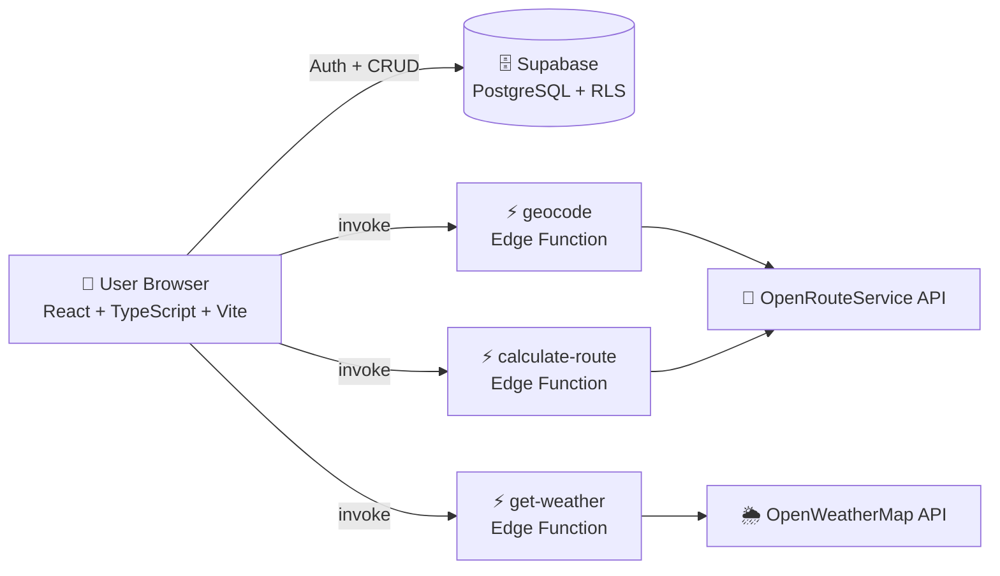

<div align="center">

# 🌿 EcoTrail

### Walk greener. Track your impact. Make every commute count.

A full-stack web app that plans eco-friendly routes, estimates the CO₂ you save by choosing active transport, and tracks your health and environmental impact over time.

[](https://carbon-wise-commute.lovable.app/)


</div>

---

## 🌍 Why EcoTrail?

Transport is one of the largest sources of urban carbon emissions, yet most navigation apps optimise only for speed. **EcoTrail flips that**: it shows you the environmental and health payoff of walking instead of driving, so the greener choice becomes the obvious one.

> 🎯 Aligned with **UN SDG 13 – Climate Action**.

---

## ✨ Features

| | Feature | What it does |
|---|---|---|
| 🗺️ | **Smart Route Planner** | Search any start and destination with live place autocomplete, or use your current location, and get a walking route with distance, duration, and step-by-step directions. |
| 🌱 | **Carbon Savings Estimator** | Calculates the CO₂ you avoid versus driving (baseline ≈ 120 g CO₂/km) for every route. |
| 🔥 | **Health Metrics** | Estimates calories burned from the distance and time you actively travel. |
| ⚡ | **Live Speed Tracker** | Uses the browser Geolocation API to show your real-time speed as you move. |
| ⛅ | **Weather Awareness** | Live local weather (temperature, humidity, wind) so you can pick the right moment to walk or cycle. |
| 📊 | **Personal Impact Dashboard** | Your total distance, calories, walking time, and CO₂ saved, aggregated across all logged trips. |
| 🔐 | **Secure Accounts** | Email and password authentication with per-user data isolation through PostgreSQL Row Level Security. |
| 🏅 | **Achievements Data Model** | Schema and policies in place for points and badges. |

---

## 🏗️ Architecture



**Design decisions worth noting**

- 🔑 **Third-party API keys never reach the browser.** Geocoding, routing, and weather calls go through Supabase **Deno Edge Functions**, which hold the keys as server-side secrets.
- 🛡️ **Row Level Security on every table.** Users can only read and write their own profiles, activities, and achievements (`auth.uid() = user_id`).
- 🧩 **Typed end to end.** TypeScript throughout, with generated Supabase types and Zod-validated forms.

---

## 🗃️ Database Schema

| Table | Purpose | Key columns |
|---|---|---|
| `profiles` | User profile linked to `auth.users` | `full_name`, `avatar_url` |
| `activities` | Every logged trip | `activity_type`, `distance_km`, `duration_minutes`, `calories_burned`, `co2_saved_kg`, `route_data` (JSONB) |
| `achievements` | Points and badges earned | `achievement_type`, `title`, `points`, `earned_at` |

Migrations live in [`supabase/migrations`](./supabase/migrations).

---

## 🛠️ Tech Stack

| Layer | Tools |
|---|---|
| **Frontend** | React, TypeScript, Vite, React Router, TanStack Query |
| **UI** | Tailwind CSS, shadcn/ui (Radix UI), Lucide icons, Recharts, Sonner |
| **Forms and validation** | React Hook Form, Zod |
| **Backend** | Supabase (Auth, PostgreSQL, Row Level Security), Deno Edge Functions |
| **External APIs** | OpenRouteService (geocoding and routing), OpenWeatherMap (weather) |
| **Browser APIs** | Geolocation API |

---

## 🚀 Getting Started

### Prerequisites
- Node.js 18+ and npm
- A free [Supabase](https://supabase.com) project
- API keys for [OpenRouteService](https://openrouteservice.org) and [OpenWeatherMap](https://openweathermap.org/api)

### 1. Clone and install
```bash
git clone https://github.com/Shivangdubey049/carbon-wise-commute.git
cd carbon-wise-commute
npm install
```

### 2. Configure environment variables
Create a `.env` file in the project root:
```env
VITE_SUPABASE_URL=https://<your-project-id>.supabase.co
VITE_SUPABASE_PUBLISHABLE_KEY=<your-supabase-anon-key>
VITE_SUPABASE_PROJECT_ID=<your-project-id>
```

### 3. Set up the backend
```bash
# Link your project and apply the database schema
npx supabase link --project-ref <your-project-id>
npx supabase db push

# Store API keys as server-side secrets (never in the frontend)
npx supabase secrets set OPENROUTESERVICE_API_KEY=<your-key>
npx supabase secrets set OPENWEATHER_API_KEY=<your-key>

# Deploy the edge functions
npx supabase functions deploy geocode
npx supabase functions deploy calculate-route
npx supabase functions deploy get-weather
```

### 4. Run it
```bash
npm run dev
```
Open **http://localhost:8080** (or the port Vite prints) and start planning greener trips. 🌱

---

## 📁 Project Structure

```
carbon-wise-commute/
├── src/
│   ├── components/        # Hero, RoutePlanner, SpeedTracker, WeatherDisplay, Impact, ...
│   │   └── ui/            # shadcn/ui primitives
│   ├── contexts/          # AuthContext (Supabase session management)
│   ├── hooks/             # useActivities, useProfile, ...
│   ├── integrations/      # Supabase client and generated types
│   └── pages/             # Index, Auth, NotFound
└── supabase/
    ├── functions/         # geocode, calculate-route, get-weather (Deno)
    └── migrations/        # SQL schema + RLS policies
```

---

## 🗺️ Roadmap

- [ ] 🚴 Multi-modal routing (cycling and public transport) with side-by-side CO₂ comparison
- [ ] 🏆 Leaderboards, weekly challenges, and automatic badge awarding
- [ ] 🔔 Weather-based smart notifications
- [ ] 📈 Richer analytics: weekly and monthly trends with charts
- [ ] 🧠 Personalised route suggestions based on trip history

---

## 🤝 Contributing

Ideas and pull requests are welcome! Fork the repo, create a feature branch, and open a PR.

## 👤 Author

**Shivang Dubey**, B.Tech CSE (AI & ML), ABES Institute of Technology

[](https://github.com/Shivangdubey049)
[](https://linkedin.com/in/shivangdubey049)

<div align="center">

⭐ **If you like this project, give it a star!** ⭐

*Small steps, big impact. 🌍*

</div>
